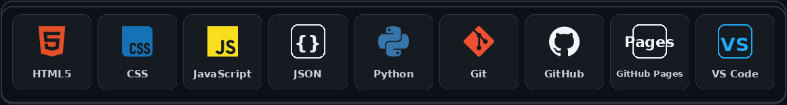
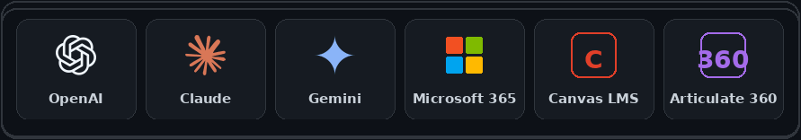

# Daniel Wooddell

**Founder & CEO, Wooddell Digital Ventures LLC · Senior Educational Technologist**

I build practical, accessible technology experiences at the intersection of higher education, artificial intelligence, web development, and digital product design.

For nearly two decades, I have worked across higher education, healthcare IT, SaaS, enterprise systems, technical support, and digital learning. At Xavier University, I lead support, training, research, and implementation for educational technologies while developing faculty-facing resources that make complex tools easier to understand and use.

Through **Wooddell Digital Ventures LLC**, I am building **WInterface™**, a browser-based media and interaction platform designed around customization, accessibility, responsive design, and low-friction use.

## Featured Work

### [WInterface™](https://w-interface.com/)

A customizable, browser-based media and interaction platform with multiple visual themes, flexible media support, accessibility-focused controls, screen recording tools, responsive layouts, real-time interaction capabilities, and extensible content support.

### [Wooddell Digital Ventures LLC](https://wooddelldigitalventures.com/)

A founder-led digital product company focused on practical, user-centered technology. WInterface™ is its current flagship product.

### [Teaching with Technology](https://www.xavier.edu/teachingwithtech/)

A faculty-facing educational technology ecosystem that organizes tools, teaching strategies, accessibility guidance, and practical implementation resources.

### [Generative AI Hub](https://www.xavier.edu/teachingwithtech/genai/)

A structured collection of AI guidance for higher education, including prompting support, tool comparisons, quick wins, examples, responsible-use considerations, and Jesuit teaching perspectives.

### [EdTech Assistant (ETA)](https://chatgpt.com/g/g-69ffe6dfccf48191b6afb459d0c78cce-edtech-assistant-eta)

A custom GPT designed to provide practical educational technology support for faculty and staff, including guidance on Canvas, accessibility, instructional tools, generative AI, and other commonly used academic technologies.

## Technologies and Platforms

### Web and Development

  

### Web Platforms, Analytics, and Services

  

### AI, Learning, and Collaboration

  

## Current Focus

- Completing a Master of Science in **Instructional Design & Development**
- Building and refining **WInterface™** as the flagship product of Wooddell Digital Ventures
- Learning and applying **Python** for validation, automation, testing, and development tooling
- Exploring responsible and practical uses of generative AI in teaching, course design, and faculty workflows
- Expanding accessible, faculty-centered educational technology resources
- Applying web analytics, performance monitoring, and security tools to better understand and improve digital experiences
- Creating web experiences that are useful, responsive, and visually distinctive without becoming unnecessarily complex

## Areas of Expertise

- Educational technology strategy and implementation
- Generative AI integration for education and business
- Learning management systems and academic technology
- HTML, CSS, JavaScript, responsive design, and web application prototyping
- Accessibility and inclusive digital design
- Web analytics, performance monitoring, and privacy-conscious measurement
- Technical training, documentation, and faculty support
- SaaS operations, customer experience, and service improvement
- Project management and cross-functional collaboration
- Web platform testing, troubleshooting, security, and iterative product development

## Professional Background

- **Founder & CEO**, Wooddell Digital Ventures LLC
- **Senior Educational Technologist**, Xavier University
- Former **Senior Application Analyst**, Greater Cincinnati Water Works
- Former **Information Technology Manager**, Medicfusion EMR
- Quality Matters Certified
- Project Management Professional (**PMP**)
- Microsoft-certified in **Career Essentials in Generative AI**

## How I Approach Technology

I prefer technology that solves a real problem, respects the user, and makes the next step clear.

My work is generally guided by four principles:

1. **Practical over performative**
2. **Accessible by design**
3. **Support people, not just systems**
4. **Build, test, refine, and keep moving**

## Connect

- [LinkedIn](https://www.linkedin.com/in/daniel-wooddell/)
- [Portfolio](https://danielwooddell.com/)
- [Email](mailto:daniel@wooddelldigitalventures.com)
- [Wooddell Digital Ventures](https://wooddelldigitalventures.com/)
- [WInterface™](https://w-interface.com/)

> Technology should reduce friction, expand access, and make the next step obvious.
